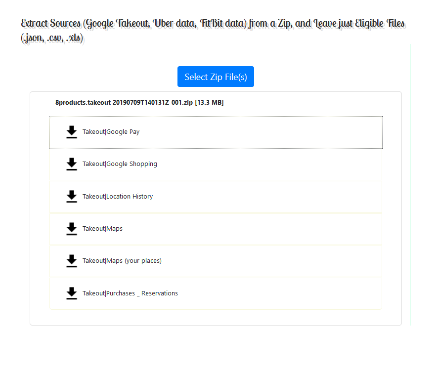

# Zip-Split
A PWA application extracting "sources" from a zip w/o decompression and re-compression.
Written in pure vanilla JavaScript.

To run:

- python3 server3.py
- go to localhost:8092 in your browser.

 
